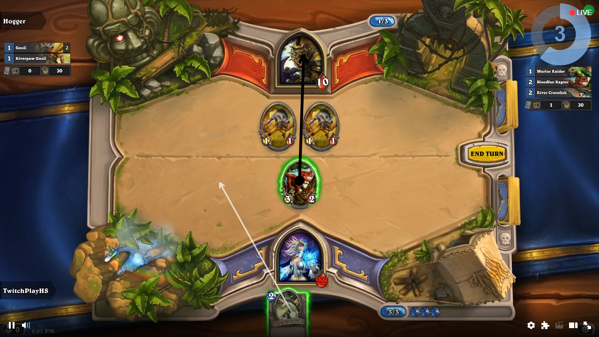

The Twitch extension to [TwitchPlayzHS](https://github.com/Vilvalas/twitch-playz-hs). You can read more about Twitch Extensions [on the official website](https://www.twitch.tv/p/extensions/).

This Extension collects mouse input from viewers of a live stream and sends it to the configured backend-server.

The Extension is still live on Twitch under the name [Screen Controls](https://www.twitch.tv/ext/fpgrhspactjwtf8u5lc6pwd4e4lnhw-0.0.1).

